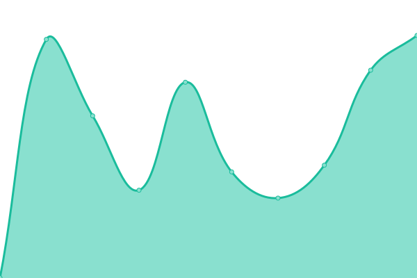

# [📈 Live Status](https://eramba.github.io): <!--live status--> **🟩 All systems operational**

This repository contains the open-source uptime monitor and status page for [Eramba](http://www.eramba.org), powered by [Upptime](https://github.com/upptime/upptime).

With [Upptime](https://upptime.js.org), you can get your own unlimited and free uptime monitor and status page, powered entirely by a GitHub repository. We use [Issues](https://github.com/eramba/upptime/issues) as incident reports, [Actions](https://github.com/eramba/upptime/actions) as uptime monitors, and [Pages](https://eramba.github.io) for the status page.

<!--start: status pages-->
<!-- This summary is generated by Upptime (https://github.com/upptime/upptime) -->
<!-- Do not edit this manually, your changes will be overwritten -->
<!-- prettier-ignore -->
| URL | Status | History | Response Time | Uptime |
| --- | ------ | ------- | ------------- | ------ |
|  [Eramba Web](https://www.eramba.org/about-us) | 🟩 Up | [eramba-web.yml](https://github.com/eramba/upptime/commits/HEAD/history/eramba-web.yml) | 

 839ms
     
 | 

<a href="https://eramba.github.io/upptime/history/eramba-web">100.00%</a>
    

|  [Eramba Discussions](https://discussions.eramba.org/about) | 🟩 Up | [eramba-discussions.yml](https://github.com/eramba/upptime/commits/HEAD/history/eramba-discussions.yml) | 

 667ms
     
 | 

<a href="https://eramba.github.io/upptime/history/eramba-discussions">100.00%</a>
    

|  [Eramba Plugins](https://plugins.eramba.org) | 🟩 Up | [eramba-plugins.yml](https://github.com/eramba/upptime/commits/HEAD/history/eramba-plugins.yml) | 

 1045ms
     
 | 

<a href="https://eramba.github.io/upptime/history/eramba-plugins">100.00%</a>
    

|  [Demo Community Cloud](https://demo.cloud.eramba.org/login) | 🟩 Up | [demo-community-cloud.yml](https://github.com/eramba/upptime/commits/HEAD/history/demo-community-cloud.yml) | 

 1079ms
     
 | 

<a href="https://eramba.github.io/upptime/history/demo-community-cloud">100.00%</a>
    

|  [Demo Enterprise Cloud](https://demo-e.cloud.eramba.org/login) | 🟩 Up | [demo-enterprise-cloud.yml](https://github.com/eramba/upptime/commits/HEAD/history/demo-enterprise-cloud.yml) | 

 719ms
     
 | 

<a href="https://eramba.github.io/upptime/history/demo-enterprise-cloud">96.77%</a>
    

|  [Demo Enterprise Cloud API](https://demo-e.cloud.eramba.org/api/projects/index) | 🟩 Up | [demo-enterprise-cloud-api.yml](https://github.com/eramba/upptime/commits/HEAD/history/demo-enterprise-cloud-api.yml) | 

 6125ms
     
 | 

<a href="https://eramba.github.io/upptime/history/demo-enterprise-cloud-api">96.77%</a>
    

<!--end: status pages-->

[**Visit our status website →**](https://eramba.github.io)

## 📄 License

- Powered by: [Upptime](https://github.com/upptime/upptime)
- Code: [MIT](./LICENSE) © [Eramba](http://www.eramba.org)
- Data in the `./history` directory: [Open Database License](https://opendatacommons.org/licenses/odbl/1-0/)
